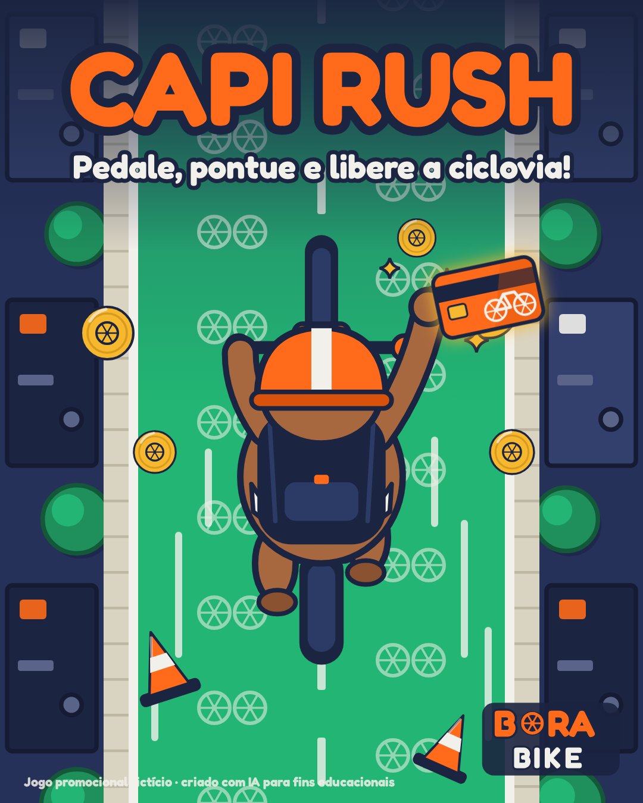

# Capi Rush: Ciclovia Livre

Advergame da Prática 02 de Modelagem e Animação 3D, feito para o briefing 8 da lista: Bora Bike, aluguel de bicicletas, campanha do plano mensal para estudantes.

Link do jogo: https://enzorossi11.github.io/aulade3D/game/



## A ideia

Eu queria um jogo simples de entender logo de cara, e lembrei daqueles jogos antigos de carro em que você fica desviando dos outros carros que vêm descendo pela tela. Troquei o carro por uma bike e os carros por cones, buracos e poças, porque o briefing não deixa mostrar o ciclista em situação de risco no trânsito.

A mascote é a Capi, uma capivara universitária que está sempre de capacete (outra exigência do briefing). Escolhi capivara porque é o bicho mais "paulistano" que existe e combina com o tom leve que a marca pede.

O produto entra no jogo como power-up: de vez em quando cai um Passe Mensal, e quem pega libera a ciclovia por 5 segundos. A rua fica verde, os obstáculos somem e os pontos dobram. É a promessa do plano ("com o plano o caminho fica livre") virando mecânica, o que dá o nível demonstrativo de integração.

A partida dura 45 segundos. No celular você toca nos lados da tela ou arrasta o dedo, e no computador usa as setas. No final aparece a pontuação e o código BORAPEDALA para usar no app (o código é fictício).

## Onde está cada coisa

- `briefing/`: o briefing da Bora Bike e os 3 conceitos que considerei
- `docs/`: mini-GDD e relatório final
- `prompts/`: ficha da mascote e log de prompts
- `assets/`: model sheet, estados da Capi, cenário, itens, logo e botões. A arte foi feita em vetor, e os arquivos-fonte estão em `assets/_fonte_svg/`
- `game/`: o jogo (`index.html`), o link e os prints
- `divulgacao/`: key art 4:5

## Para rodar sem internet

Precisa abrir por um servidor local, senão o navegador bloqueia o carregamento das imagens:

```
python3 -m http.server
```

Depois é só abrir `http://localhost:8000/game/` no navegador.

---

Bora Bike e o código promocional são fictícios, criados para fins educacionais, com auxílio de IA generativa, conforme a declaração no relatório. Fonte Fredoka, licença SIL Open Font License.
